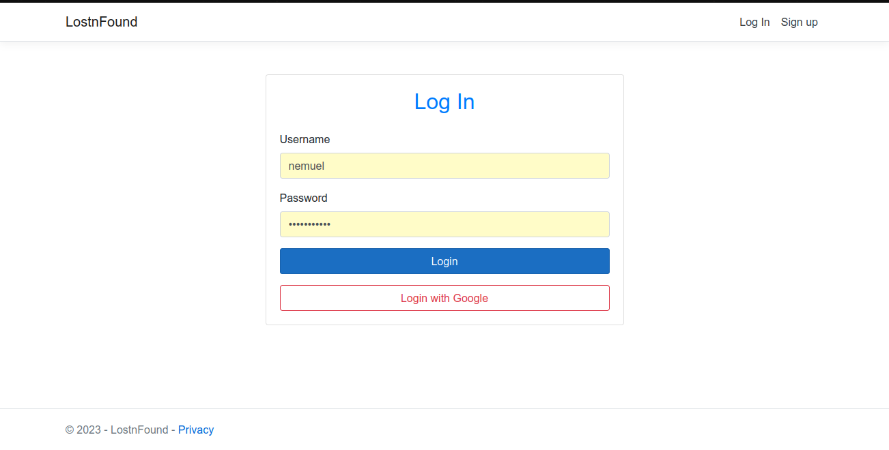
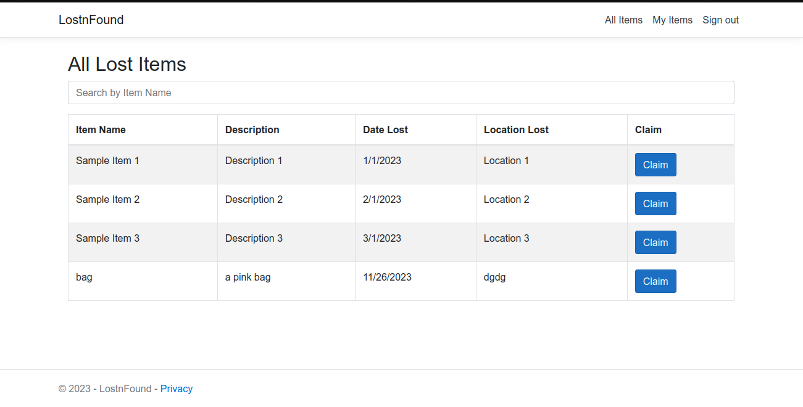
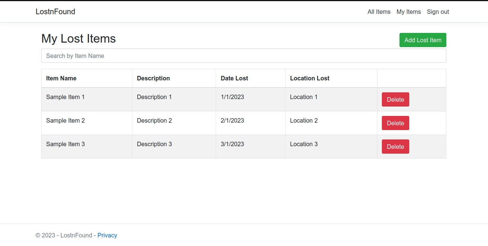
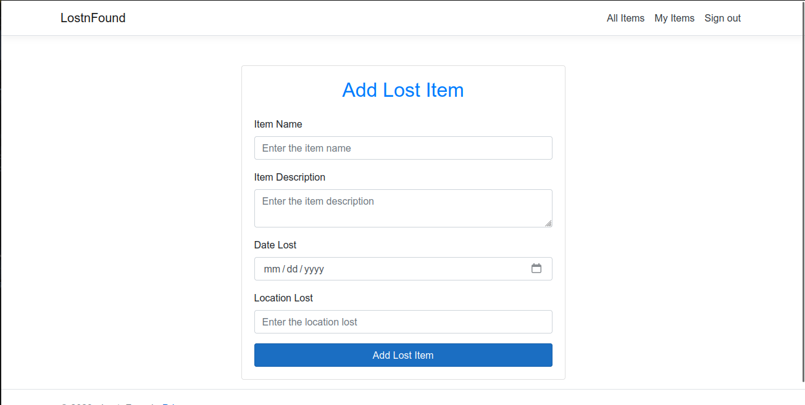

# LostnFound

Report lost items and potentially get in touch with someone that found it

## Screenshots

## Requirements

- A Code editor or IDE
- Dotnet v5.0
- Dotnet Entity Framework (dotnet-ef)
- MSSQL Server

## Setup

- Open this project in an IDE or code editor of your choice, preferably VS Code
- Run the command `dotnet restore` to install project dependencies
- Run the command `dotnet ef database update 0` to create the database and apply all migrations to it

## Usage

- Run the command `dontnet watch run` to start the project
- Open your browser to the provided URL
- Sign up for a new account, then proceed to login
- You can now add lost items as well as view others' lost items
- Feel free to play around with the add-new-item and claim-item functionality
